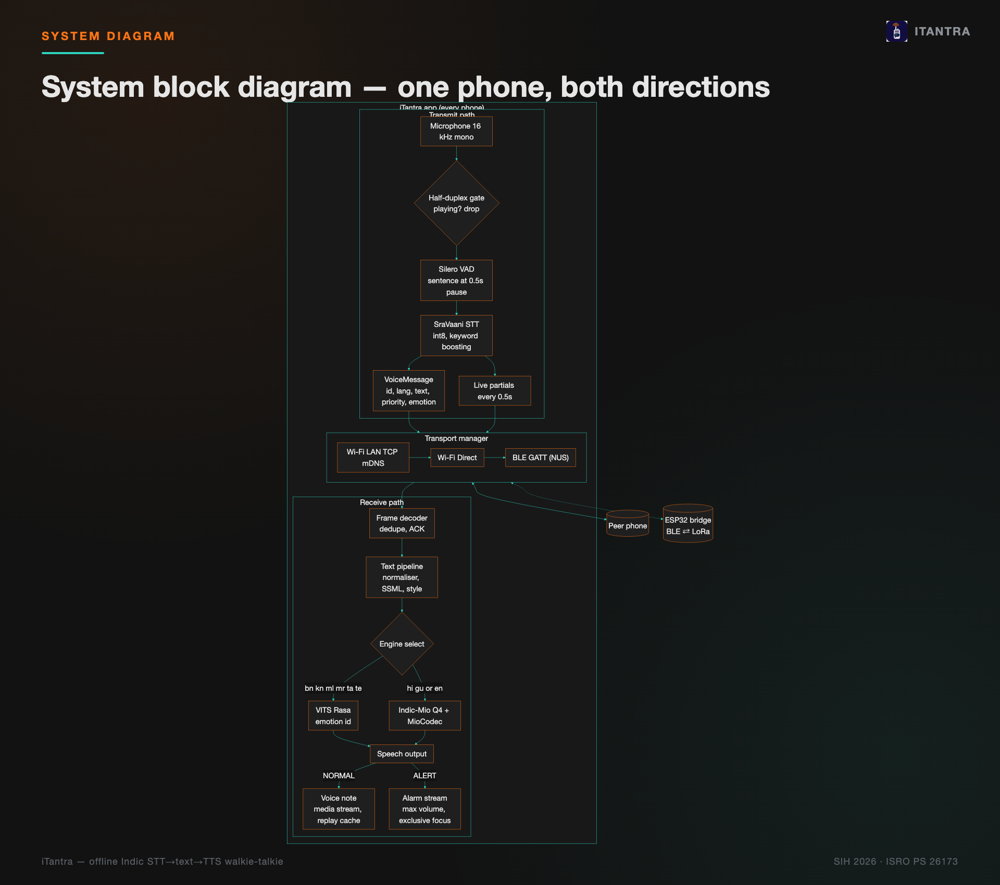
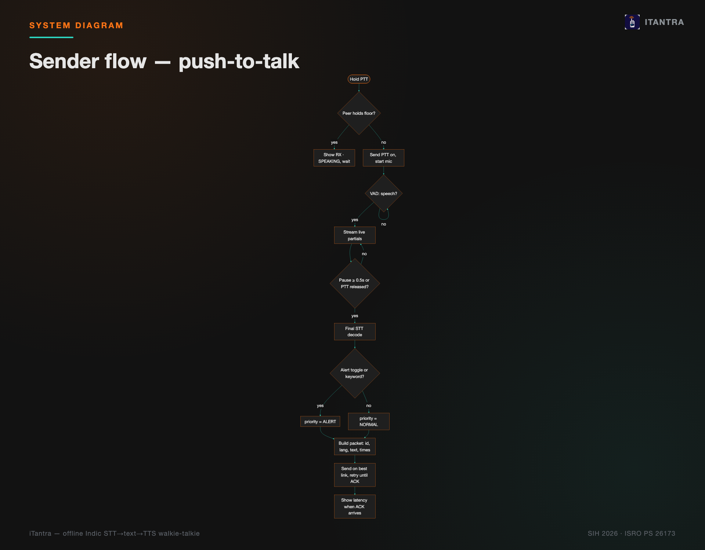
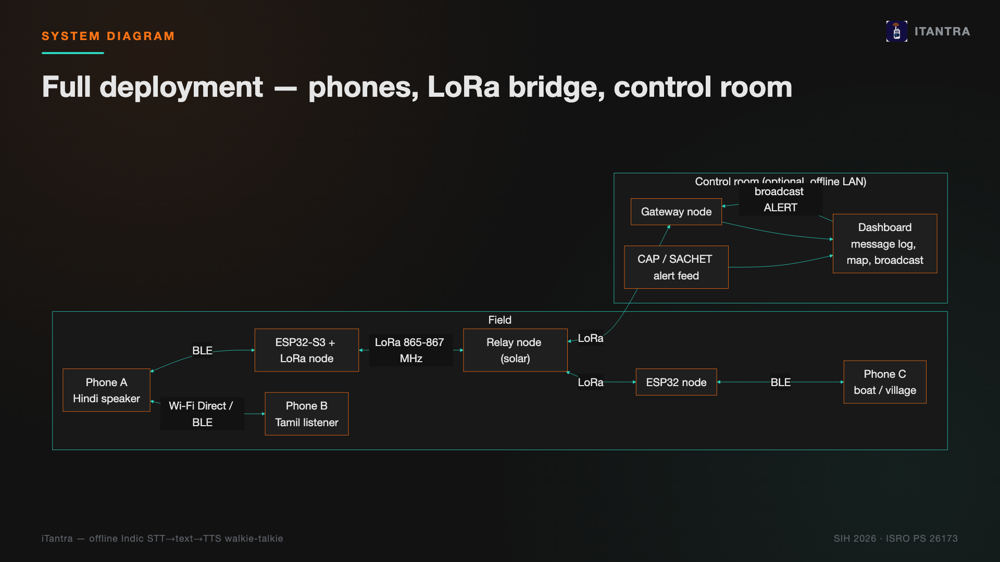
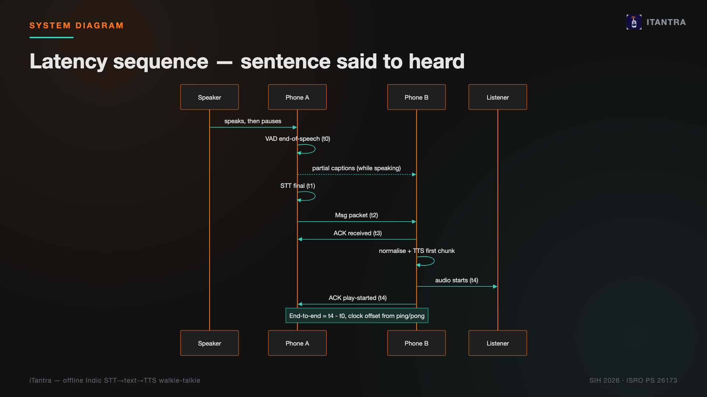
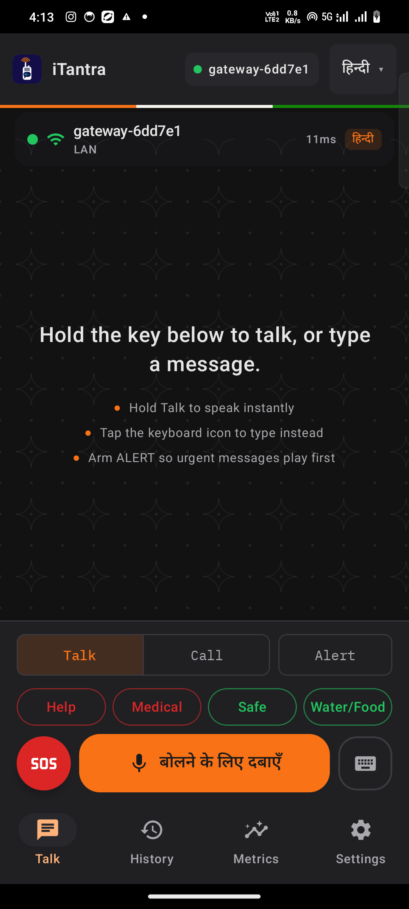
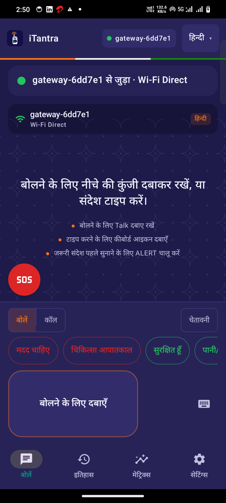
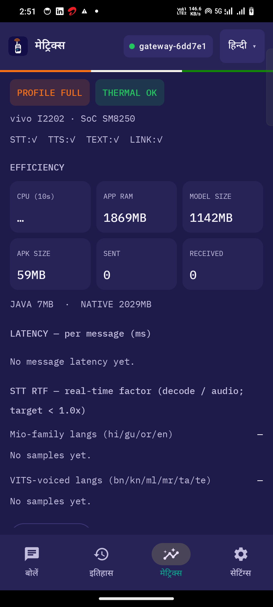
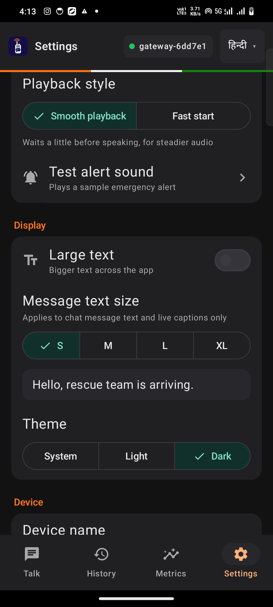
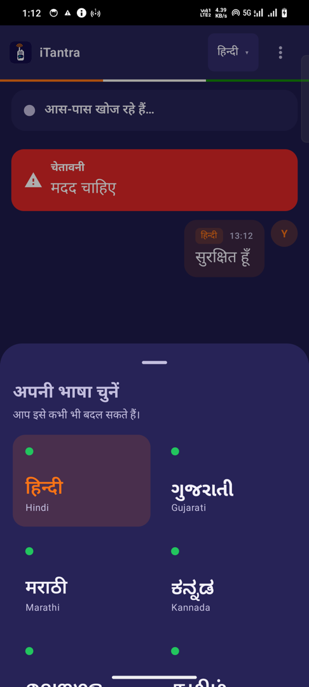
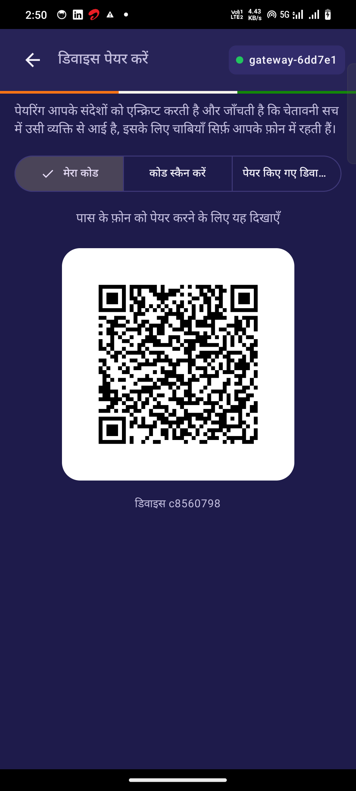

# iTantra — showcase

Offline, multilingual voice walkie-talkie for India. Speech becomes text on one phone; text becomes
speech on the other — over Wi-Fi, Bluetooth LE, or a LoRa bridge, with no tower and no internet.
Built for **SIH 2026, ISRO Problem Statement 26173**.

Open [`index.html`](index.html) in a browser for the full interactive showcase (works offline, no
server needed). This file is a GitHub-friendly summary of the same content.

## Overview

A spoken sentence needs about 256 kbps as raw audio, but the links that survive a disaster —
Bluetooth LE, a congested Wi-Fi hotspot, a long-range radio bridge — carry only hundreds of bits
per second. iTantra sends only the *text* of what was said (a semantic codec, not an audio codec),
then speaks it back in the listener's own language on the other phone.

## How it works

| | |
|---|---|
|  |  |
|  |  |

More diagrams (receiver flow, link fallback) are in [`images/`](images/).

## App screens

| | | |
|---|---|---|
|  |  |  |
|  |  |  |

## Demo video

**[iTantra_explainer.mp4](iTantra_explainer.mp4)** — a ~2 minute walkthrough of the whole system,
narrated, with real phone clips. Captions: [iTantra_explainer.srt](iTantra_explainer.srt).

### Individual phone clips

- [`clips/01_onboarding.mp4`](clips/01_onboarding.mp4) — First-run onboarding: greeting cycling per language, "Speak your language" grid (10 Indic languages), offline-capability page, and "Built on Indian open AI" credits/permissions page. Onboarding flag was cleared to re-trigger this, then restored (onboarding_done=true, ui_locale_tag=en) after recording.
- [`clips/02_receive_voice.mp4`](clips/02_receive_voice.mp4) — Talk screen receiving 3 gateway broadcast messages in Hindi, Tamil, and English in sequence; message cards appear and are spoken aloud (device audio captured).
- [`clips/03_alert.mp4`](clips/03_alert.mp4) — Gateway sends a Hindi ALERT (flood warning); red alert card appears with flash and is spoken at device volume.
- [`clips/05_sos.mp4`](clips/05_sos.mp4) — Tap SOS button, bottom sheet opens with location coordinates and quick templates, real tap sends "बचाव चाहिए" (need rescue) request; delivered confirmation and history show the sent card with GPS coordinates. Location services were temporarily enabled for this clip and switched back off afterward.
- [`clips/04_speak_to_text.mp4`](clips/04_speak_to_text.mp4) — DEBUG_STT_WAV injected on hi.wav then ta.wav test clips, running the real on-device STT pipeline; transcribed sentences appear as sent messages in History with delivery ticks. Audio is injected from bundled test clips, not live microphone speech.
- [`clips/06_settings_text_size.mp4`](clips/06_settings_text_size.mp4) — Settings tour: message text size S -> XL, theme System -> Dark -> Light, speech playback speed 0.8x -> 1.3x, then everything reset back to defaults (M / System / 1.0x), confirmed against itantra_settings.xml.
- [`clips/07_metrics_history.mp4`](clips/07_metrics_history.mp4) — Metrics dashboard (CPU/RAM/model size, latency histogram, STT real-time-factor) scrolled, then History screen with searchable/filterable message log scrolled.
- [`clips/08_hindi_ui.mp4`](clips/08_hindi_ui.mp4) — App language switched from English to Hindi (हिन्दी) via Settings > App language picker, quick tour of Talk and Settings screens fully localized, then switched back to English at the end; ui_locale_tag confirmed restored to "en".

## Results (measured)

| Metric | Value | Note |
|---|---:|---|
| STT word error rate | 5.9% | 10 FLEURS clips, 1/language — preliminary |
| STT real-time factor | 0.05 | 18–22× faster than real time |
| TTS first audio | 0.6–0.95 s | Indic-Mio hi/gu/en; VITS faster |
| End-to-end latency | ≈1.5–2.5 s | sentence said → heard on other phone |
| Idle CPU (PTT mode) | 0.3–1.6% | measured, resource snapshot log |
| App memory, LITE profile | 688 MB | phones under 6 GB RAM |
| Median wire size / sentence | 62 B | binary frame + per-script dictionary, 310 real sentences |
| APK size (arm64) | 60 MB | native runtimes; models side-loaded |
| Message → ACK (Wi-Fi) | ≈41 ms | phone ↔ Mac peer simulator |

**Caveats:** STT WER is measured on 10 clips (1 per language), not the planned 30-clip harness.
Thermal throttling can slow decode 2–4× on a hot phone. End-to-end latency uses one physical
phone in both sender and receiver roles via a peer simulator, not a live two-phone measurement.

## Hardware & gateway

- **ESP32-S3 + SX1262 LoRa bridge** — relays app packets between BLE and LoRa
  (865–867 MHz, India's license-free band). Compiled and size-checked (RAM 9.3%, Flash 17.2% on
  an 8 MB Heltec WiFi LoRa 32 V3); not yet run on real hardware. SF7 airtime for an 80-byte sentence
  is ~144–154 ms (near real-time); SF12 is 3.3–7.2 s (max range only). BOM ~₹1,900–3,200/node.
- **Control-room gateway** (`tools/gateway/`) — joins the phone mesh as a peer, logs every message
  to SQLite, and serves a live dashboard (connected peers, per-language counts, latency, approximate
  locations, broadcast, CAP 1.2 alert ingestion). Screenshot: `images/dashboard.png`.

## Credits

**Models:** SraVaani-1.0 STT (ARTPARK, IISc · MIT) · Indic-Mio TTS (SPRING Lab, IIT Madras ·
Apache-2.0) · VITS Rasa 13 TTS (AI4Bharat · CC-BY-4.0) · Silero VAD (MIT)

**Runtimes & data:** sherpa-onnx (k2-fsa · Apache-2.0) · llama.cpp / ggml, mio-tts-cpp (MIT) ·
Google FLEURS (CC-BY-4.0) · AI4Bharat Rasa expressive TTS data (CC-BY-4.0)

**Alignment:** UN Early Warnings for All (SDG 11 & 13) · NDMA SACHET CAP-based alerting ·
Smart India Hackathon 2026 · ISRO Problem Statement 26173

Every model and runtime here is open source; no paid APIs are used in training or at runtime.
